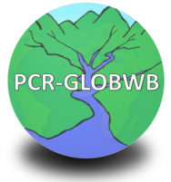

{: align=right height="100px"}
# PCR-GLOBWB

PCRaster Global Water Balance (PCR-GLOBWB)[@sutanudjaja18] is a large-scale hydrological model intended for global to regional studies and developed at the [Department of Physical Geography, Utrecht University (Netherlands)](https://www.uu.nl/en/organisation/faculty-of-geosciences).

The PCR-GLOBWB source code can be found at [our GitHub repository](https://github.com/UU-Hydro/PCR-GLOBWB_model).

